# Credit-Card-Fraud-Detection

Link : https://www.kaggle.com/mlg-ulb/creditcardfraud

Overview: 

The dataset contains transactions made by credit cards in September 2013 by european cardholders.
This dataset presents transactions that occurred in two days, where we have 492 frauds out of 284,807 transactions. 

It contains only numerical input variables which are the result of a PCA transformation. Unfortunately, due to confidentiality issues,the original features and more background information about the data is not provided. Features V1, V2, … V28 are the principal components obtained with PCA, the only features which have not been transformed with PCA are 'Time' and 'Amount'. Feature 'Time' contains the seconds elapsed between each transaction and the first transaction in the dataset. The feature 'Amount' is the transaction Amount, this feature can be used for example-dependant cost-senstive learning. Feature 'Class' is the response variable and it takes value 1 in case of fraud and 0 otherwise.

Business Problem : 

Our aim is to develop a Classifier model that accurately identifies fraudulent credit card transactions.

Implications: 

While consumers are shielded from having to pay for fraudulent transactions, financial institutions and merchants are responsible for covering the cost of the fraudulent transactions.
Generally, financial institutions are responsible for fraud on in-store transactions and merchants are responsible for fraud committed in online transactions.
Improvement in fraud detection can save financial institutions and merchants millions of dollars in cost annually.

Variables: 

There are 31 variables.
The time, amount and class of transaction (1 = fraud, 0 = legitimate transaction).
There are 28 other variables which are the result of PCA transformation on the original data. We have no information about what the original variables were.

Imbalance in the Dependent Class:

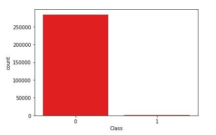

Disribution of Amount: 

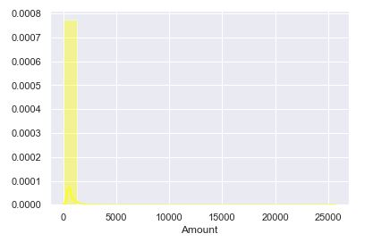

Distribution of Time:

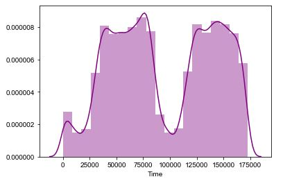

Correlation Between the Variables: 

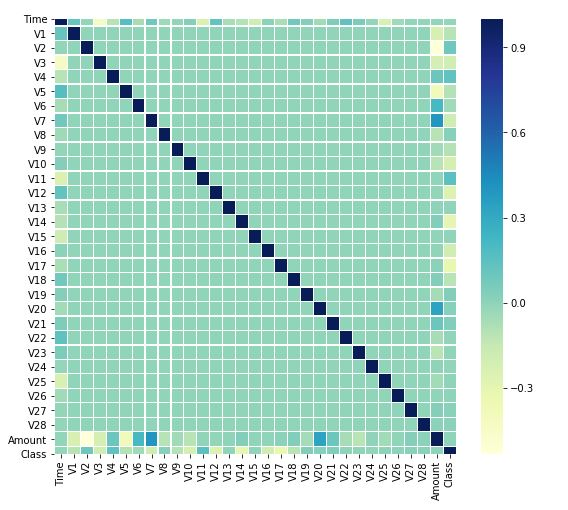

Classifier Models:

We split the dataset into 70% train and 30% test to measure the model performance. 

Model Performance - Metrics: 

Essentially, rather than aiming for overall accuracy on the entire dataset, we care more about catching most of the fraud cases (recall), whilst keeping the cost at which this is achieved under control (precision). Usually, this is captured in the f1 score. However, asymmetrical costs for type I and II errors complicate the matters and mean we have to rely on our own cost function.

Decision Tree Classifier: 

A decision tree is a flowchart-like tree structure where an internal node represents feature(or attribute), the branch represents a decision rule, and each leaf node represents the outcome. The topmost node in a decision tree is known as the root node. It learns to partition on the basis of the attribute value. It partitions the tree in recursively manner call recursive partitioning. This flowchart-like structure helps you in decision making. It's visualization like a flowchart diagram which easily mimics the human level thinking. That is why decision trees are easy to understand and interpret.

The Decision Tree model classifier at a threshold of 0.5 gave an accuracy of 99%. But since our focus is on Precision and Recall. We plotted a Precsion vs Recall Curve to determine the model's performance.  

The model on the Training data gave a Precision of 97%, Recall of 79% and F-measure of 87%.

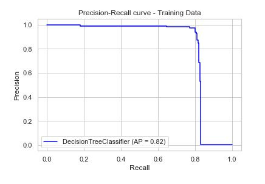

The model on the Testing data gave a Precision of 83%, Recall of 79% and F-measure of 81%.

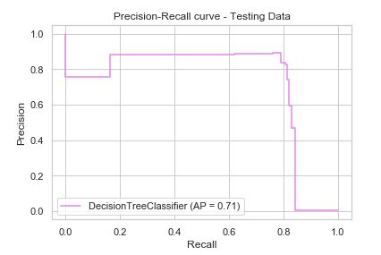

Logistic Regression Model:

Logistic regression is a statistical method for predicting binary classes. The outcome or target variable is dichotomous in nature. Dichotomous means there are only two possible classes. For example, it can be used for cancer detection problems. It computes the probability of an event occurrence.

It is a special case of linear regression where the target variable is categorical in nature. It uses a log of odds as the dependent variable. Logistic Regression predicts the probability of occurrence of a binary event utilizing a logit function.

The Logit model at a threshold of 0.5 gave an accuracy of 99%.

The model on the Training data gave a Precision of 91%, Recall of 67% and F-measure of 77%.

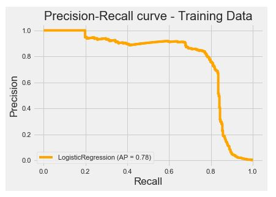

The model on the Training data gave a Precision of 76%, Recall of 68% and F-measure of 72%.

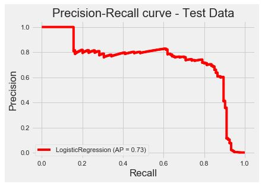

Naive - Bayes Classifier: 

Naive Bayes is a statistical classification technique based on Bayes Theorem. It is one of the simplest supervised learning algorithms. Naive Bayes classifier is the fast, accurate and reliable algorithm. Naive Bayes classifiers have high accuracy and speed on large datasets.

The Naive - Bayes Classifier at a threshold of 0.5 gave an accuracy of 97%.

The model on the Training data gave a Precision of 6%, Recall of 81% and F-measure of 11%.

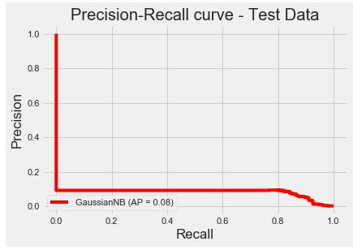

The model on the Training data gave a Precision of 5%, Recall of 87% and F-Measure of 11%.

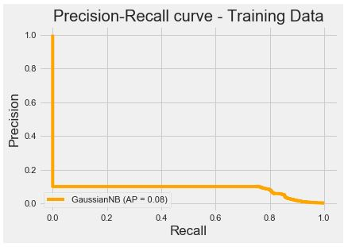

The precision metric of Naive - Bayes Classifier was really low. 

Random Forest model:

It technically is an ensemble method (based on the divide-and-conquer approach) of decision trees generated on a randomly split dataset. This collection of decision tree classifiers is also known as the forest. The individual decision trees are generated using an attribute selection indicator such as information gain, gain ratio, and Gini index for each attribute. Each tree depends on an independent random sample. In a classification problem, each tree votes and the most popular class is chosen as the final result. In the case of regression, the average of all the tree outputs is considered as the final result. It is simpler and more powerful compared to the other non-linear classification algorithms.

Feature Importance: 

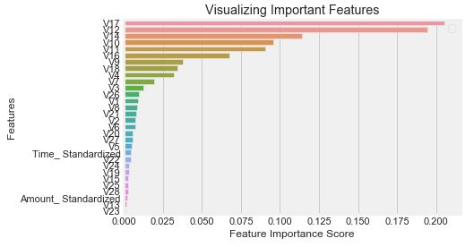

First we ran a loop with different estimators to detemine the optimum numbers of estimators for our model. 

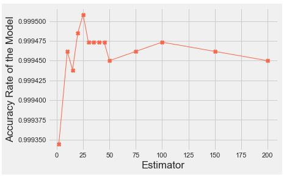

The Ranodm Forest model with number of estimators 100 gave an accuracy of 99%.

The model on the Training data gave a Precision of 96%, Recall of 73% and F-Measure of 83%.

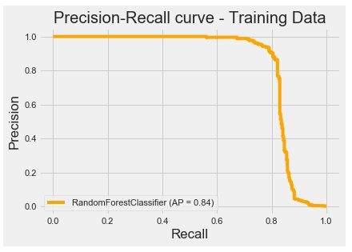

The model on the Testing data gave a Precision of 89%, Recall of 75% and F-Measure of 81%.

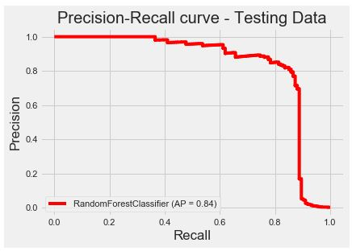

Model Selection: 

As mentioned earlier, to keep the cost under control we focussed on precision rather than accuracy. 

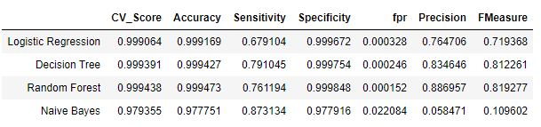

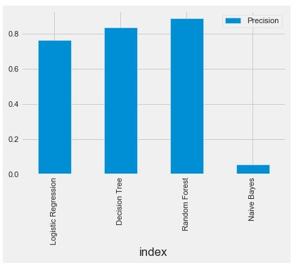

Random Forest model gave us the best metrics needed for this classification. 
